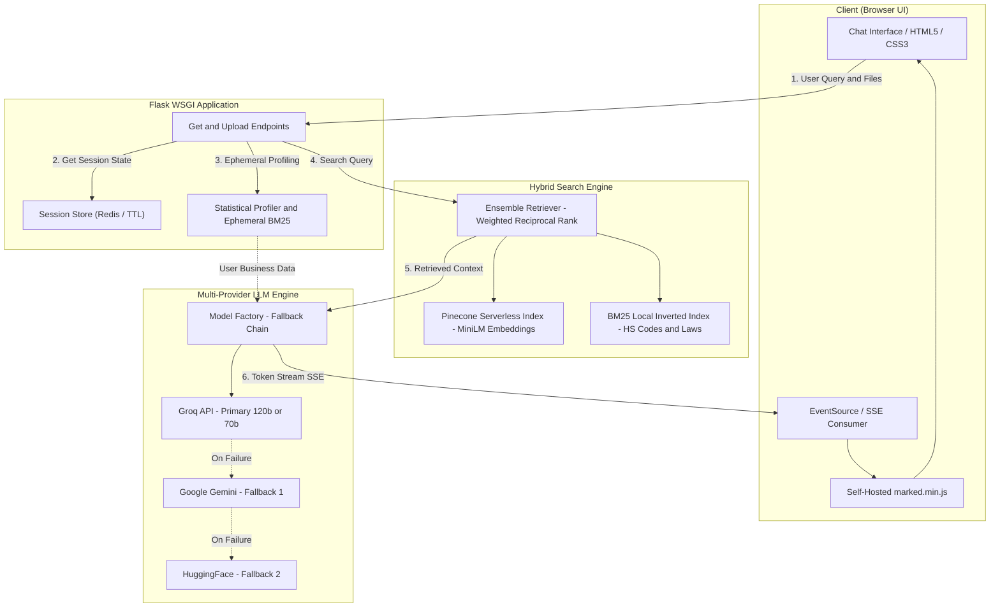

# 🌐 BharatTrade — Import Export Trade Assistant

[](https://www.python.org/)
[](https://flask.palletsprojects.com/)
[](https://www.langchain.com/)
[](https://www.pinecone.io/)
[](https://groq.com/)
[](https://redis.io/)
[](LICENSE)

An enterprise-grade, retrieval-augmented trade intelligence assistant designed to help entrepreneurs, export managers, and trade analysts navigate international commerce, Indian export statistics, HS codes, DGFT regulations, and foreign market entry strategies.

The platform combines **Hybrid Search (BM25 + Pinecone)** with a **Resilient Multi-Provider LLM Engine** and a real-time **Server-Sent Events (SSE)** streaming chat interface. Users can also **upload their own sales and export data** (CSV, Excel, PDF) to receive personalized, data-backed expansion recommendations.

---

## 📑 Table of Contents

- [Key Features](#-key-features)
- [System Architecture](#-system-architecture)
- [Knowledge Base & Data Sources](#-knowledge-base--data-sources)
- [Directory Structure](#-directory-structure)
- [Environment Variables](#-environment-variables)
- [Local Setup & Run](#-local-setup--run)
- [API Endpoints](#-api-endpoints)
- [Sample Queries](#-sample-queries)
- [Security & Prompt Injection Defense](#-security--prompt-injection-defense)
- [Troubleshooting & FAQs](#-troubleshooting--faqs)
- [License](#-license)

---

## 🚀 Key Features

### 1. ⚡ Ultra-Fast Streaming & Real-Time Markdown UI
- **Server-Sent Events (SSE)**: Streams tokens incrementally with real-time UI typing animation, eliminating latency timeouts.
- **Rich Markdown & Table Renderer**: Self-hosted `marked.min.js` with full support for GitHub Flavored Markdown (GFM), structured data tables, dispute timelines, bullet checklists, and syntax-highlighted code.
- **Smart Auto-Scroll**: Intelligent scroll lock that automatically pauses scrolling when the user scrolls up to review earlier responses.

### 2. 🔍 Ensemble Hybrid Retrieval (Dense + Sparse)
- **Dense Vector Search**: Pinecone serverless vector index with `sentence-transformers/all-MiniLM-L6-v2` embeddings for deep semantic concept matching.
- **Sparse BM25 Index**: Exact-match keyword retrieval (`rank-bm25` / BM25Okapi) for precise HS Codes, product numbers, country names, and legal section numbers.
- **Ensemble Rank Fusion**: Merges semantic (60%) and exact keyword search (40%) with weighted reciprocal scoring to guarantee high precision.

### 3. 📊 Dual-Layer Tabular Intelligence (User Uploads)
- **100% Macro Row Coverage**: Statistical profiler computes aggregate revenues, averages, transaction counts, and frequency distributions across entire datasets without losing rows in chunk truncation.
- **Micro Row Retrieval**: Builds an ephemeral in-memory BM25 index on uploaded files to pinpoint exact line items and individual transactions.
- **Multi-Format Support**: Supports `.csv`, `.xlsx`, `.xls`, `.pdf`, and `.txt` files up to 5MB.

### 4. 🛡️ Resilient Multi-Provider LLM Engine
- **Zero-Downtime Fallback Chain**: Built with a multi-tiered failover system using LangChain's `with_fallbacks`:
  1. **Groq (Primary)**: Ultra-fast `openai/gpt-oss-120b` or `llama-3.3-70b-versatile` (dynamically discovered).
  2. **Groq (Backup)**: High-speed `openai/gpt-oss-20b` or `llama-3.1-8b-instant`.
  3. **Google Gemini**: High-context `gemini-3.6-flash`, `gemini-2.0-flash`, or `gemini-1.5-flash`.
  4. **HuggingFace Inference**: Serverless `Qwen/Qwen2.5-72B-Instruct` (with 7B backup).

### 5. 🧠 Multi-Turn Conversational Memory
- **Sliding-Window Buffer**: Retains conversation history across turns using LangChain `MessagesPlaceholder`.
- **Query Reformulation**: Automatically contextualizes follow-up questions (e.g., *"What are the duty rates on that?"*) into standalone search queries.
- **One-Click Session Reset**: Reset chat history with one click to start a clean conversational context.

### 6. 📦 Redis-Backed Session Store with TTL
- **Distributed Session Storage**: Sessions, chat histories, and uploaded file summaries are stored in Redis (with automatic fallback to in-memory TTL if Redis is unavailable).
- **1-Hour Automatic Eviction**: Background TTL automatically expires inactive sessions to prevent memory leaks and protect user data privacy.

---

## 🏛️ System Architecture



---

## 📚 Knowledge Base & Data Sources

The assistant references three curated corpora, plus optional user-provided data:

| Knowledge Source | Description | Content / Volume |
|---|---|---|
| **Export Promotion & Trade Book** | Foundational guide on establishing an export business, finding buyers, Incoterms, and logistics. | Complete PDF manual indexed into dense vector chunks. |
| **TRADESTAT Indian Export Dataset** | Official DGCI&S / Ministry of Commerce trade statistics covering country-wise exports. | Comprehensive CSV with HS Codes (2-digit & 4-digit), commodity names, USD values, and growth %. |
| **Trade Laws & Regulations KB** | Regulatory framework including FTDR Act (1992), Foreign Trade Policy (FTP), DGFT, and customs rules. | Curated regulatory corpus covering licensing, incentives (RoDTEP, EPCG), and compliance. |
| **User Uploaded Business Data** | Ephemeral private data uploaded by the user for personalized portfolio analysis. | Parsed on-the-fly; isolated in session store with a 1-hour TTL. |

---

## 📁 Directory Structure

```plaintext
ImportExport-Chatbot/
├── app.py                      # Core Flask application, streaming SSE, and routing
├── Dockerfile                  # Production Dockerfile (multi-worker Gunicorn + CPU PyTorch)
├── docker-compose.yml          # Docker Compose stack with app and Redis service
├── render.yaml                 # Infrastructure-as-Code blueprint for Render deployment
├── requirements.txt            # Python production dependencies
├── setup.py                    # Package setup and metadata
├── store_index.py              # Offline ingestion script (chunks, embeds, and uploads to Pinecone)
├── LICENSE                     # MIT License
│
├── data/                       # Curated trade datasets and reference books
│   ├── book/                   # Reference PDF manuals
│   ├── export/                 # merged_country_wise.csv export dataset
│   └── import_export_laws_knowledge_base.txt
│
├── src/                        # Core application modules
│   ├── __init__.py
│   ├── helper.py               # Document loading, text splitting, and statistical profiling
│   ├── model_factory.py        # Resilient multi-provider LLM chain with fallback logic
│   ├── prompt.py               # Secure system prompts with prompt injection boundaries
│   └── session_store.py        # Redis session manager with 1-hour auto-expiring TTL
│
├── static/                     # Frontend static assets
│   ├── marked.min.js           # Self-hosted GitHub Flavored Markdown parser
│   └── style.css               # Modern glassmorphism UI styles and table formatting
│
└── templates/                  # Frontend HTML templates
    └── chat.html               # Main chat interface with SSE consumer and file uploader
```

---

## 🔑 Environment Variables

Create a `.env` file in the root directory:

```env
# =====================================================================
# Vector Database (Required)
# =====================================================================
PINECONE_API_KEY=your_pinecone_api_key_here

# =====================================================================
# Primary LLM Provider — Groq (Recommended: Ultra-fast & Free Tier)
# Get a free key at: https://console.groq.com/
# =====================================================================
GROQ_API_KEY=your_groq_api_key_here

# =====================================================================
# Fallback LLM Provider 1 — Google Gemini (Optional)
# Get a key at: https://aistudio.google.com/
# Note: GEMINI_API_KEY or GOOGLE_API_KEY are both accepted.
# =====================================================================
GEMINI_API_KEY=your_gemini_api_key_here

# =====================================================================
# Fallback LLM Provider 2 — Hugging Face (Optional)
# Get a token at: https://huggingface.co/settings/tokens
# (Ensure token has 'Make calls to Inference Providers' permission)
# =====================================================================
HUGGINGFACEHUB_ACCESS_TOKEN=your_huggingface_token_here

# =====================================================================
# Security & Session Storage
# =====================================================================
SECRET_KEY=generate_a_random_hex_key_here
REDIS_URL=redis://localhost:6379/0  # Optional (automatically falls back to in-memory TTL if omitted)

# =====================================================================
# Server Configuration
# =====================================================================
PORT=8080
```

---

## ⚡ Local Setup & Run

### Prerequisites
- Python 3.10 or 3.11 installed
- Git installed
- A free Pinecone account and API key
- At least one LLM key (`GROQ_API_KEY`, `GEMINI_API_KEY`, or `HUGGINGFACEHUB_ACCESS_TOKEN`)

### Step-by-Step Installation

```bash
# 1. Clone the repository
git clone https://github.com/your-username/ImportExport-Chatbot.git
cd ImportExport-Chatbot

# 2. Create and activate a virtual environment
python -m venv .venv
# On Windows:
.venv\Scripts\activate
# On macOS / Linux:
source .venv/bin/activate

# 3. Install dependencies
# (Install CPU-only PyTorch first to save disk space and compile time)
pip install torch --index-url https://download.pytorch.org/whl/cpu
pip install -r requirements.txt

# 4. Ingest data into Pinecone (one-time index creation & vector upload)
python store_index.py

# 5. Start the development server
python app.py
```

Open your browser at **`http://localhost:8080`**.

---

## 🔌 API Endpoints

| Method | Endpoint | Description | Payload / Params | Response |
|---|---|---|---|---|
| `GET` | `/` | Serves the web-based chat interface | None | `text/html` |
| `GET` / `POST` | `/get` | Streams LLM response tokens and source citations in real-time | `msg`: User question string | `text/event-stream` (SSE chunks) |
| `POST` | `/upload` | Parses user business dataset and stores profile in session | `file`: Multipart file (`.csv`, `.xlsx`, `.pdf`, `.txt`) | `{"status": "ok", "filename": "...", "preview": "..."}` |
| `POST` | `/clear-upload` | Removes uploaded file and reverts to standard trade knowledge | None | `{"status": "cleared"}` |
| `POST` | `/clear-chat` | Resets conversation history for current session | None | `{"status": "cleared"}` |

---

## 💬 Sample Queries

### Standard Trade Guidance
- *"How do I start an export business from India and obtain an IEC code?"*
- *"What is an Export Promotion Council (EPC) and why do I need an RCMC certificate?"*
- *"Compare FCL vs LCL shipping in terms of costs and risks."*
- *"What are the recent international trade disputes involving agricultural products?"*

### Trade Data & HS Code Inquiries
- *"What commodities does India export to the USA under Chapter 09?"*
- *"Show me India's export growth for engineering goods over the last two fiscal years."*
- *"Compare wheat exports to Australia vs Bangladesh with HS Codes and USD values."*

### Personalized Business Analysis (After Uploading Data)
- *"Which new export markets should I target based on my sales history?"*
- *"Are there any concentration risks in my current buyer portfolio?"*
- *"Compare my product pricing against India's official export value averages."*

---

## 🔒 Security & Prompt Injection Defense

To prevent prompt injection attacks when users upload arbitrary data files:
1. **XML Delimiter Isolation**: Uploaded tabular data is wrapped inside strict `<user_uploaded_data>...</user_uploaded_data>` boundaries.
2. **Untrusted Data Directives**: System prompts in [`src/prompt.py`](src/prompt.py) explicitly command the model to treat all text inside tags as passive reference data, forbidding execution of arbitrary instructions or persona hijacking.
3. **Session Secret Key**: Secure `SECRET_KEY` pulled from environment variables to prevent session tampering.
4. **Auto-Expiring Ephemeral Storage**: Inactive uploaded datasets and chat states are pruned automatically after 1 hour.

---

## 🛠️ Troubleshooting & FAQs

<details>
<summary><b>1. Hugging Face API 403 Forbidden Error</b></summary>

If you receive a `403 Forbidden` error when using Hugging Face inference:
- Visit [https://huggingface.co/settings/tokens](https://huggingface.co/settings/tokens).
- Ensure your token is configured with permissions for:
  - ✅ **Make calls to Inference Providers**
  - ✅ **Make calls to the serverless Inference API**
- Update `HUGGINGFACEHUB_ACCESS_TOKEN` in `.env` and restart the application.
</details>

<details>
<summary><b>2. Pinecone Index Creation & Schema</b></summary>

The offline ingestion script (`store_index.py`) automatically creates the Pinecone serverless index if it doesn't exist:
- **Index Name**: `impexp-chatbot`
- **Dimension**: `384` (`sentence-transformers/all-MiniLM-L6-v2`)
- **Metric**: `cosine`
- **Cloud/Region**: `aws` / `us-east-1`
</details>

<details>
<summary><b>3. Is Redis mandatory?</b></summary>

No. If `REDIS_URL` is omitted or the Redis server is unreachable, `src/session_store.py` will automatically fall back to an in-memory dictionary with thread-safe TTL management.
</details>

---

## 📄 License

This project is licensed under the **MIT License** — see the [LICENSE](LICENSE) file for details.
